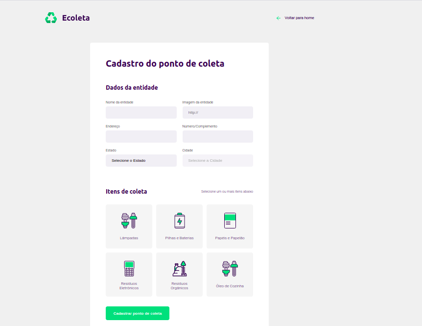
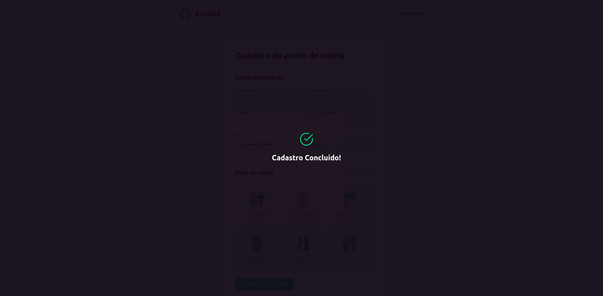
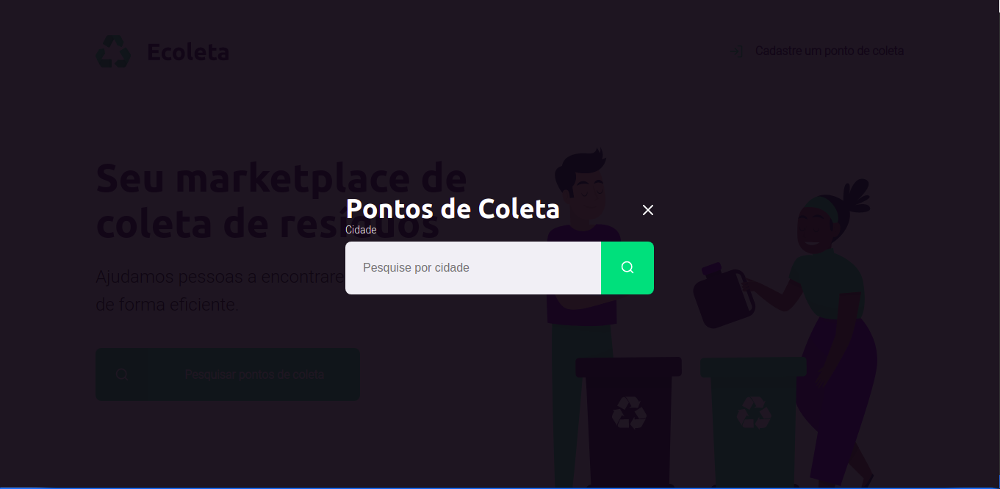
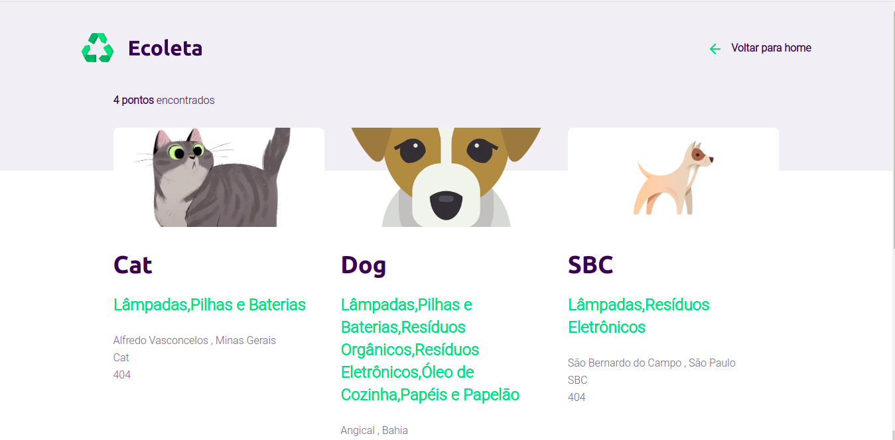

# Projeto NLW - Ecoleta 

Desenvolvimento do site Ecoleta, projeto esse ministrado na semana 1 da NLW da Rocketseat. Consiste num site onde o usuário pode cadastrar novos pontos de coleta de certos materiais, bem como pode pesquisar locais em sua região.

## Funcionalidade

**Home** - O usuário pode cadastrar um novo ponto de coleta ou pesquisar os pontos já cadastrados.

**Cadastrar** - O usuário pode cadastrar um novo ponto de coleta, basta inserir os dados necessários, como nome, endereço, estado, cidade e afins, bem como quais categorias de produto esse ponto coleta. Ao final do cadastro aparece uma mensagem de sucesso, caso ocorra perfeitamente a inserção do novo ponto no banco de dados.

**Pesquisa** - Na home o usuário pode selecionar pesquisar pontos de coleta, desse modo abre-se uma tela, ainda na home, onde o mesmo pode inserir a cidade em que deseja procurar um ponto.

**Resultados** - Exibe o resultado da pesquisa realizada pelo usuário, caso não haja nenhum input, exibirá a lista completa de todos os pontos já cadastrados.

## Execução

Tanto no Windows quanto no Linux a execução é feita a partir da execução do seguinte comando.

``
npm start
``

Importante ressaltar que é necessário instalar alguns components:

<ul>
    <li>Node JS</li>
    <li>Nodemon</li>
    <li>Sqlite3</li>
</ul>